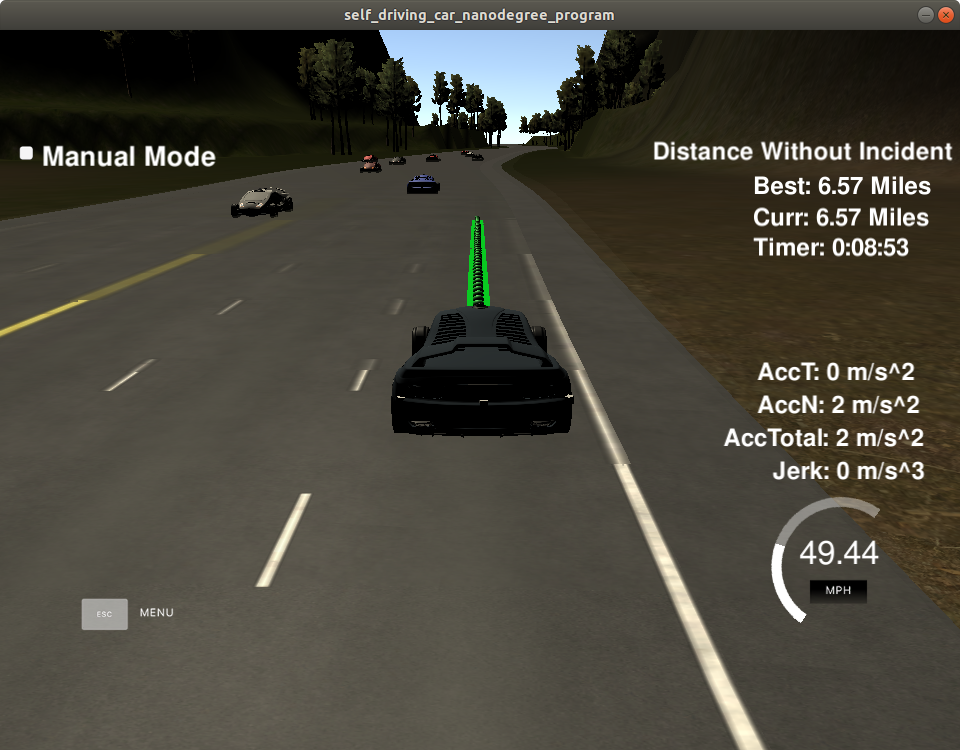

# CarND-Path-Planning-Project
Self-Driving Car Engineer Nanodegree Program
   
### Simulator.
You can download the Term3 Simulator which contains the Path Planning Project from the [releases tab (https://github.com/udacity/self-driving-car-sim/releases/tag/T3_v1.2).  

To run the simulator on Mac/Linux, first make the binary file executable with the following command:
```shell
sudo chmod u+x {simulator_file_name}
```

### Goals
In this project your goal is to safely navigate around a virtual highway with other traffic that is driving +-10 MPH of the 50 MPH speed limit. You will be provided the car's localization and sensor fusion data, there is also a sparse map list of waypoints around the highway. The car should try to go as close as possible to the 50 MPH speed limit, which means passing slower traffic when possible, note that other cars will try to change lanes too. The car should avoid hitting other cars at all cost as well as driving inside of the marked road lanes at all times, unless going from one lane to another. The car should be able to make one complete loop around the 6946m highway. Since the car is trying to go 50 MPH, it should take a little over 5 minutes to complete 1 loop. Also the car should not experience total acceleration over 10 m/s^2 and jerk that is greater than 10 m/s^3.

#### The map of the highway is in data/highway_map.txt
Each waypoint in the list contains  [x,y,s,dx,dy] values. x and y are the waypoint's map coordinate position, the s value is the distance along the road to get to that waypoint in meters, the dx and dy values define the unit normal vector pointing outward of the highway loop.

The highway's waypoints loop around so the frenet s value, distance along the road, goes from 0 to 6945.554.

## Basic Build Instructions

1. Clone this repo.
2. Make a build directory: `mkdir build && cd build`
3. Compile: `cmake .. && make`
4. Run it: `./path_planning`.

Here is the data provided from the Simulator to the C++ Program

#### Main car's localization Data (No Noise)

["x"] The car's x position in map coordinates

["y"] The car's y position in map coordinates

["s"] The car's s position in frenet coordinates

["d"] The car's d position in frenet coordinates

["yaw"] The car's yaw angle in the map

["speed"] The car's speed in MPH

#### Previous path data given to the Planner

//Note: Return the previous list but with processed points removed, can be a nice tool to show how far along
the path has processed since last time. 

["previous_path_x"] The previous list of x points previously given to the simulator

["previous_path_y"] The previous list of y points previously given to the simulator

#### Previous path's end s and d values 

["end_path_s"] The previous list's last point's frenet s value

["end_path_d"] The previous list's last point's frenet d value

#### Sensor Fusion Data, a list of all other car's attributes on the same side of the road. (No Noise)

["sensor_fusion"] A 2d vector of cars and then that car's [car's unique ID, car's x position in map coordinates, car's y position in map coordinates, car's x velocity in m/s, car's y velocity in m/s, car's s position in frenet coordinates, car's d position in frenet coordinates. 

## Details

1. The car uses a perfect controller and will visit every (x,y) point it recieves in the list every .02 seconds. The units for the (x,y) points are in meters and the spacing of the points determines the speed of the car. The vector going from a point to the next point in the list dictates the angle of the car. Acceleration both in the tangential and normal directions is measured along with the jerk, the rate of change of total Acceleration. The (x,y) point paths that the planner recieves should not have a total acceleration that goes over 10 m/s^2, also the jerk should not go over 50 m/s^3. (NOTE: As this is BETA, these requirements might change. Also currently jerk is over a .02 second interval, it would probably be better to average total acceleration over 1 second and measure jerk from that.

2. There will be some latency between the simulator running and the path planner returning a path, with optimized code usually its not very long maybe just 1-3 time steps. During this delay the simulator will continue using points that it was last given, because of this its a good idea to store the last points you have used so you can have a smooth transition. previous_path_x, and previous_path_y can be helpful for this transition since they show the last points given to the simulator controller with the processed points already removed. You would either return a path that extends this previous path or make sure to create a new path that has a smooth transition with this last path.

---

## Dependencies

* cmake >= 3.5
  * All OSes: [click here for installation instructions](https://cmake.org/install/)
* make >= 4.1
  * Linux: make is installed by default on most Linux distros
  * Mac: [install Xcode command line tools to get make](https://developer.apple.com/xcode/features/)
  * Windows: [Click here for installation instructions](http://gnuwin32.sourceforge.net/packages/make.htm)
* gcc/g++ >= 5.4
  * Linux: gcc / g++ is installed by default on most Linux distros
  * Mac: same deal as make - [install Xcode command line tools]((https://developer.apple.com/xcode/features/)
  * Windows: recommend using [MinGW](http://www.mingw.org/)
* [uWebSockets](https://github.com/uWebSockets/uWebSockets)
  * Run either `install-mac.sh` or `install-ubuntu.sh`.
  * If you install from source, checkout to commit `e94b6e1`, i.e.
    ```
    git clone https://github.com/uWebSockets/uWebSockets 
    cd uWebSockets
    git checkout e94b6e1
    ```
---
# Self Evaluation against [Rubric](https://review.udacity.com/#!/rubrics/1971/view)


## Compilation
* Code complied without error.

## Valid Trajectories
* Car drove more than 4.32 miles without any incidents. Snapshot attached.
* Speed limit was maintained just below 50mph.
* Max acceleration and jerk was not exceeded. This is controlled by a low speed increment value.
* No collisions. Either change lane or slowdown.
* Car kept within a lane while driving. Lane changes took less than 3 seconds only.
* Car is able to change lane safely when behind a slower car. Car prefers to keep mid lane when it has a choice.

## Reflection
Most of the code was discussed in the [Project Q&A section](https://youtu.be/7sI3VHFPP0w) by Aaron Brown and David Silver. The starter code from udacity is set up to communicate the telemetry data. The path planning code has to supply a point set for car to traverse at 0.02 seconds interval. I've reused the code from the Project Q&A as much as possible. At this point, the code already accelerates the car slowly from zero - without jerk and keeping acceleration limits, plans way points from car position 30, 60 and 90 meters away and uses [spline](https://kluge.in-chemnitz.de/opensource/spline/) to fit it smoothly. The car also decelerates if it finds a car ahead of it.

The *TODO* section of code can be discussed in three parts.
### Scanning each lane ([line 110 to 143](./src/main.cpp#L110))
- Check if a car ahead in the same lane is within next 30 meters. Flag it if true.
- Check if a car on left lane is within 30 meters (front & back). Flag it if true.
- Check if a car on right lane is within 30 meters (front & back). Flag it if true.

These flags are the conditions to control the behvaiour of car in next section - change lane, speed up or slow down.

### Control car speed and lane ([line 145 to 165](./src/main.cpp#L145))
The section implements the following checks.
 * if there is a slow car ahead of my car, and
    - if left lane is available, plan for move to left lane
    - if right lane is available, plan for move to right lane
    - if left and right lane are not availbale, slow down.
* else , 
    - if my car is not on center lane and center lane available, plan for move to center lane.
    - if my car velocity is less than target velocity, accelerate.

The lane number from this section is used for planning the trajectory in the next part.

### Trajectory plan ([line 167 to 289](./src/main.cpp#L167))
The code Aaron and David shared in [Project Q&A section](https://youtu.be/7sI3VHFPP0w) is used as it is in this section. The waypoints are coded in as a function that uses the lane number. Therefore, based on the  plan to change lane or keep it from the earlier section the waypoints are updated. Use of spline function makes the transition smooth when updating waypoint set. 